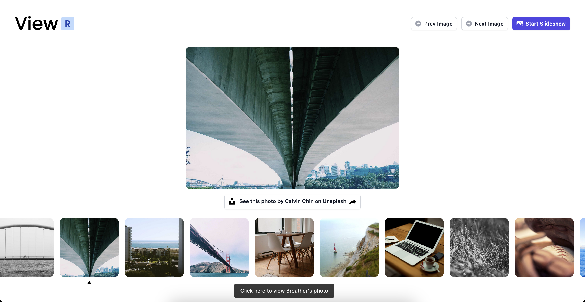

ViewR is an image viewer built with React and Tailwind CSS, deployed on Github Pages!

#### Features:
1. Click on `{Prev || Next}` Image to view that image
3. Click on Start Slideshow to view a slideshow where the images change after 3 seconds
4. Click on the individual images in the carousel to view as needed

##### All images are sourced from `unsplash.com` using the `picsum` API